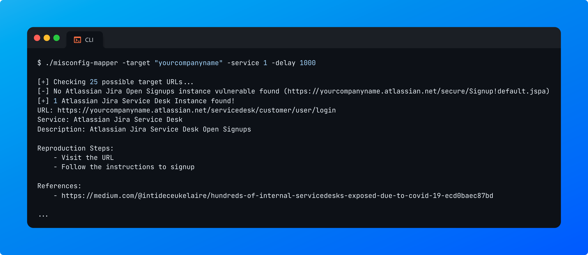

# Introduction

Misconfig Mapper is a project by Intigriti for the community to help you find, detect and resolve common security misconfigurations in various popular services, technologies and SaaS-based solutions that your targets use!

Misconfig Mapper consists out of 2 parts, the Documentation and the Scanner.

## Documentation

The documentation has all the known misconfigured services documented. Each section or service has its own misconfigurations listed.

Each page is further divided into 5 separate sections; "Description", "Testing", "Remediation", "Potential Impact" and "References" (if any).

<figure><figcaption>
<em>Example of a Public Groovy Script Console accessible on a misconfigured Jenkins instance.</em>
</figcaption></figure>

## Scanner

The open-source scanner that is written in Golang is designed to help you automate finding or detecting almost all common security misconfigurations!

Some features include:

* Automatic target enumeration (via permutations)
* Template-based (easy configuration of new services)
* Passive-only tests

<figure><figcaption>
<em>Example of a misconfigured "Atlassian Jira Service Desk" finding using Misconfig Mapper.</em>
</figcaption></figure>



## Supported Services

At the moment, there are 15+ services available. [Click here](services.md) to view the full list of services covered.


[services.md](services.md)


## Contributions

Contributions to the project are encouraged! Please learn more on how to contribute to the project on the following page:


[contributing.md](../readme/contributing.md)


## License

This project is licensed and available under the [MIT License](https://github.com/intigriti/misconfig-mapper/blob/main/LICENSE.md).
