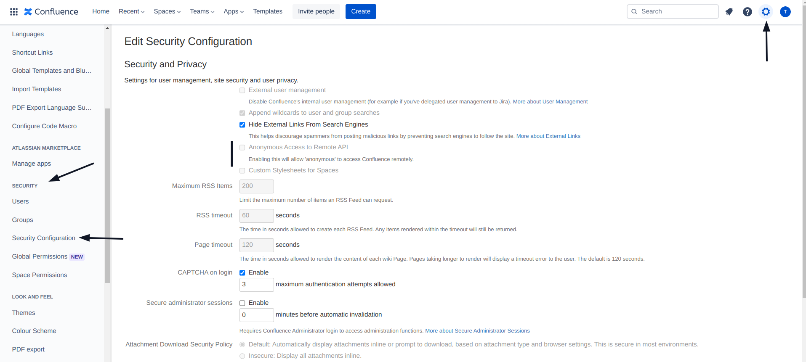

# Anonymous access to Remote API

#### Description:

Atlassian Confluence provides a Remote XML-RPC and SOAP API to change and read data in Confluence.\
\
This API is depreciated and replaced with a REST API since version 5.5 but can still be in use in some instances.\
\
It is in that case recommended to **disable anonymous access to the API** and **prevent bots from making destructive changes in bulk**.

#### Testing:

Both XML-RPC and SOAP API are currently depreciated and replaced by the REST API since Confluence v5.5.\
\
Both APIs are accessible through the following endpoints on your Confluence instance:

**XML-RPC HTTP Request to retrieve a specific page for example:**

```http
POST /rpc/xmlrpc HTTP/1.1
Host: confluence.example.com
Content-Type: text/xml
...

<?xml version="1.0" encoding="UTF-8"?>
<methodCall>
 <methodName>confluence2.getPage</methodName>
 <params>
  <param>
   <value>
    <string>{SPACE_KEY}</string>
   </value>
  </param>
  <param>
   <value>
    <string>{PAGE_TITLE}</string>
   </value>
  </param>
 </params>
</methodCall>
```

or **using cURL**:

```bash
curl -X POST -H 'Content-Type: text/xml' -d '<?xml version="1.0" encoding="UTF-8"?><methodCall><methodName>confluence2.getPage</methodName><params><param><value><string>{SPACE_KEY}</string></value></param><param><value><string>{PAGE_TITLE}</string></value></param></params></methodCall>' http://confluence.example.com/rpc/xmlrpc
```

_Replace **{SPACE\_KEY}** with your Confluence team's Space Key (this can be found over_ [_in your URL bar_](https://confluence.atlassian.com/doc/space-keys-829076188.html)_) and **{PAGE\_TITLE}** with the post's page title._

#### SOAP:

```
/rpc/soap-axis/confluenceservice-v2
```

#### Remediation:

It is always recommended to **upgrade and use the latest version available** of Atlassian Confluence.

1. Navigate to your Confluence instance and sign in
2. Open your **Administrator Settings** by clicking on the gear icon next to your profile picture
3. In your side navigation bar, scroll down to **Security** and open **Security Configurations**
4. Make sure that **Anonymous Access to Remote API** is **disabled**
5. Save your changes

<figure><figcaption></figcaption></figure>

#### Potential Impact:

It is possible for a **bad actor to conduct destructive changes in bulk** with the depreciated Remote API enabled and when anonymous access is allowed.

#### References:

* [https://developer.atlassian.com/server/confluence/remote-confluence-methods/](https://developer.atlassian.com/server/confluence/remote-confluence-methods/)
* [https://developer.atlassian.com/server/confluence/confluence-xml-rpc-and-soap-apis/](https://developer.atlassian.com/server/confluence/confluence-xml-rpc-and-soap-apis/)
* [https://confluence.atlassian.com/doc/anonymous-access-to-remote-api-151028.html](https://confluence.atlassian.com/doc/anonymous-access-to-remote-api-151028.html)
* [https://confluence.atlassian.com/doc/configuring-confluence-security-151515.html](https://confluence.atlassian.com/doc/configuring-confluence-security-151515.html)

