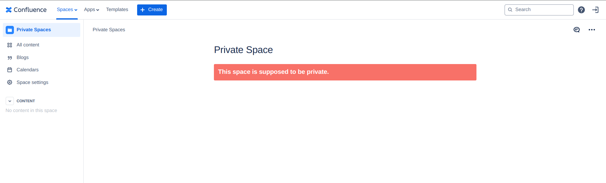
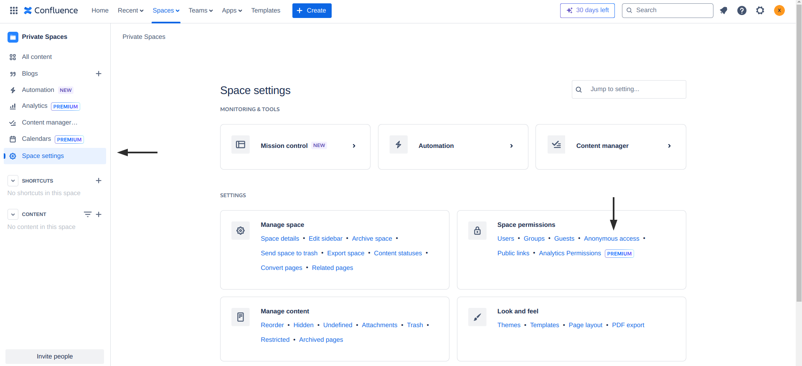

# Misconfigured Visibility Settings for Confluence Spaces

#### Description:

Confluence Spaces are an integrated feature in Atlassian Confluence to help members organize content. Spaces often contain public data such as public roadmaps, guides, knowledge bases, etc.

But these spaces can also be used to store sensitive information that is meant to be only available to internal employees. In case your visibility settings are not configured properly, you may risk disclosing potentially sensitive information to anonymous users.

#### Testing:

Visit the following application route to check if anonymous users can view and read any information on Confluence Spaces:

```
https://<companyName>.atlassian.net/wiki/spaces
```

<figure><figcaption></figcaption></figure>

Next, manually examine every Space for hardcoded credentials, sensitive data (such as financial information), or other information that is not meant to be public.

<figure><figcaption></figcaption></figure>

#### Remediation:

##### To disable anonymous access to a **specific Confluence Space**:
1. Navigate to `/wiki/spaces` on your Confluence site to list all your Confluence Spaces
2. Select the Space you would like to change its visibility settings off

<figure><figcaption></figcaption></figure>

3. Open the settings menu by clicking on **Space settings**
4. Under **Space permissions**, click on **Anonymous access**

<figure><figcaption></figcaption></figure>

5. Next, make sure to uncheck all permissions.
6. Finally, click **Save** to save all your settings.

<figure><figcaption></figcaption></figure>

Once finished, you should not be able to view the COnfluence Space as an anonymous user:

<figure><figcaption></figcaption></figure>

##### To entirely disable anonymous-level access on your **Confluence site**:
1. Click on the gear-icon on the top-right of your screen
2. Open the **Global permissions** tab under **Security**
3. Open the **Anonymous access** tab
4. Cross-check that **all permissions are disabled for Anonymous users**
5. Finally, save all your changes by clicking on **Save**

<figure><figcaption></figcaption></figure>

#### Potential Impact:

Unintentionally exposing private information (such as hard-coded secrets, internal financial data or even customer data) can introduce your company or organization to further attacks by bad actors. Generally allowing them to obtain a greater foothold in your network.

#### References:

* [https://infosecwriteups.com/hundreds-of-companies-internal-data-exposed-the-confluence-cloud-misconfiguration-63cbc143caea](https://infosecwriteups.com/hundreds-of-companies-internal-data-exposed-the-confluence-cloud-misconfiguration-63cbc143caea)
* [https://confluence.atlassian.com/doc/assign-space-permissions-139460.html](https://confluence.atlassian.com/doc/assign-space-permissions-139460.html)
* [https://support.atlassian.com/confluence-cloud/docs/make-a-space-public/](https://support.atlassian.com/confluence-cloud/docs/make-a-space-public/)
