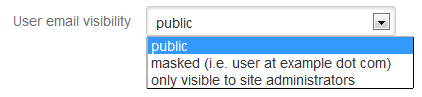
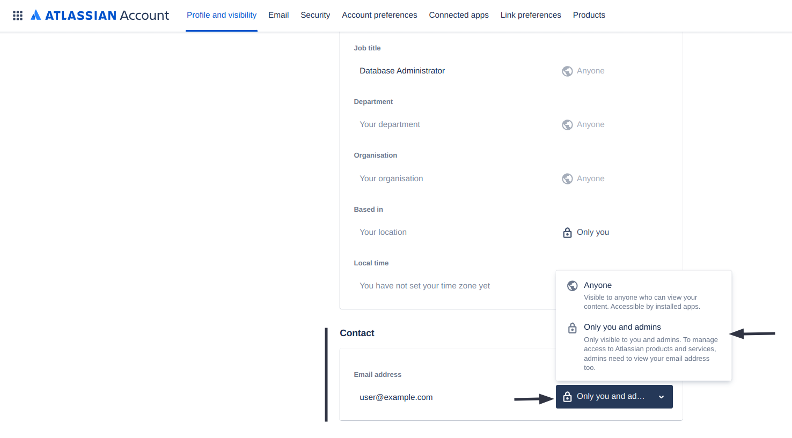

# User Email Visibility

#### Description:

**Older versions of Atlassian Confluence** provide 3 options to configure email address privacy: **Public**, **Masked** and **Only visible to site administrators**.\
\
It is recommended to set the email address visibility to **Only visible to site administrators** to maintain email privacy of existing users.


Setting email visibility to "**Only visible to site administrators"** means that emails won't be visible in User Search popups as well. [Learn more.](https://confluence.atlassian.com/doc/user-email-visibility-138596.html)


#### Testing:

There is no specific testing procedure for this misconfiguration. Email addresses are visible next to the user's name on posts for example.

#### Remediation:

To configure the visibility policy of user emails on older versions of Atlassian Confluence:

1. Navigate to your Confluence instance and sign in
2. Open your **Administrator Settings** by clicking on the gear icon next to your profile picture
3. In your side navigation bar, scroll down to **Security** and open **Security Configurations**
4. Click on **Edit** to make the fields editable
5. Select **Only visible to site administrators** from the **User email visibility** dropdown.
6. Save your changes

<figure><figcaption></figcaption></figure>

Latest versions of Confluence don't allow the Administrator to enforce email visibility settings. Instead, each individual user can now do so through his/her personal Atlassian ID portal.

1. Navigate to your **Atlassian Account** and go to your **Profile and visibility**: [https://id.atlassian.com/manage-profile/profile-and-visibility](https://id.atlassian.com/manage-profile/profile-and-visibility)
2. Next, scroll down to the **Contact** section
3. And under **Who can see this?** next to your email-address, select **Only you and admins**
4. Your changes will be saved automatically

<figure><figcaption></figcaption></figure>

#### Potential Impact:

If **user email visibility** is set to **Public**, existing **user's email addresses will be displayed publicly to anyone**.\
\
This may not impose a direct security risk to an organization or company but could potentially help in further exploitation and in information gathering.

#### References:

* [https://confluence.atlassian.com/doc/user-email-visibility-138596.html](https://confluence.atlassian.com/doc/user-email-visibility-138596.html)

