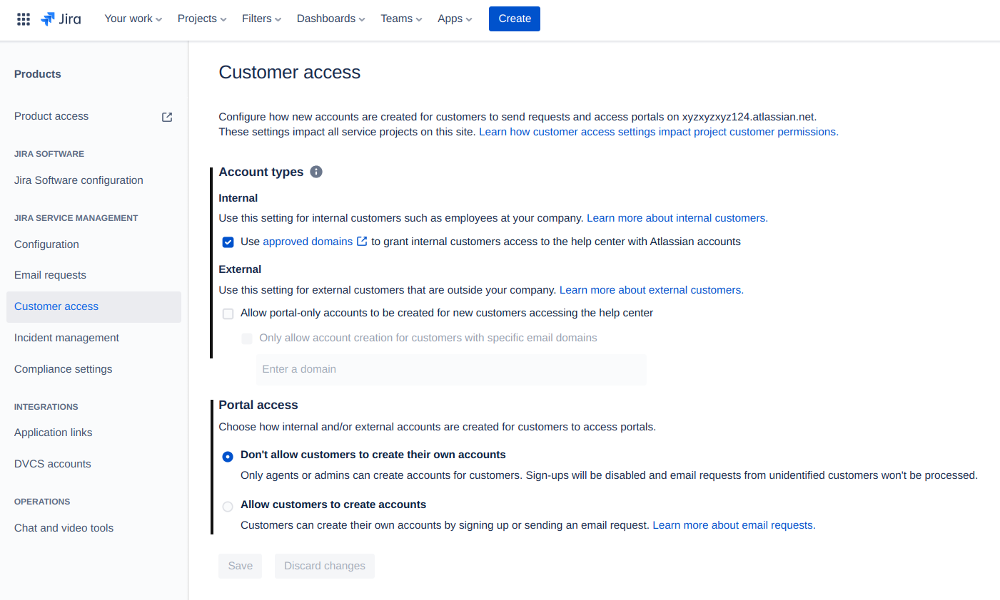
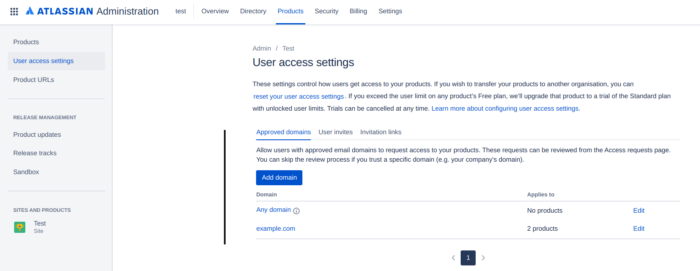

# Atlassian Jira Service Desk Open Signups

#### Description:

Atlassian Jira Service Desk may have misconfigured permissions and allow anyone to signup and get access to private or internal company support tickets via the ServiceDesk signup app route.

#### Testing:

Navigate to the following app route and check if signups are enabled:

```
/servicedesk/customer/user/login
```

#### Remediation:

Make sure to disable signups for Service Desk. One way to do so is:

1. Visit your **Jira Service Desk Configuration** (`https://{yourAtlassian}.atlassian.net/jira/settings/products/servicedesk/customer-access`)
2. Next, open up **Customer access** from the side-navigation bar
3. Make the appropriate changes and **remove Portal access for non-authorized users**
4. Save your settings

<figure><figcaption></figcaption></figure>

To further secure your company from unauthorized access to your Atlassian products, you are recommended to enforce an email domain whitelist:

To do so:

1. Visit your [Atlassian Administrator panel](https://admin.atlassian.com/)
2. Open **User access settings** from the side navigation bar
3. Next, remove all access from **Any domain** if you haven't already
4. Verify and add your own domain to only allow users with your whitelisted domain to get access

<figure><figcaption></figcaption></figure>

#### Potential Impact:

In the event that everyone can signup for an Atlassian Service Desk account, unauthorized users would be able to view and read sensitive data such as support tickets, internal-only company data and in severe cases also personal identifiable information of employees and customers.\
\
In addition to that and depending how dependent an organization or company is on Atlassian's Service Desk:\
\
It is also possible to request internal company support for for example a new access badge, requesting employment contract changes (salaries), requesting access to third-party accounts (social media accounts) and so on.

#### References:

* [https://medium.com/@intideceukelaire/hundreds-of-internal-servicedesks-exposed-due-to-covid-19-ecd0baec87bd](https://medium.com/@intideceukelaire/hundreds-of-internal-servicedesks-exposed-due-to-covid-19-ecd0baec87bd)
* [https://support.atlassian.com/jira-service-management-cloud/docs/customer-permissions-for-your-service-project-and-jira-site/](https://medium.com/@intideceukelaire/hundreds-of-internal-servicedesks-exposed-due-to-covid-19-ecd0baec87bdhttps://support.atlassian.com/jira-service-management-cloud/docs/customer-permissions-for-your-service-project-and-jira-site/)
* [https://support.atlassian.com/user-management/docs/control-how-users-get-access-to-products/](https://support.atlassian.com/user-management/docs/control-how-users-get-access-to-products/)
