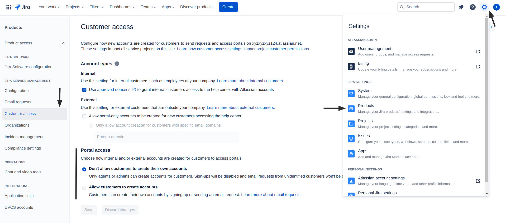

# Open User Registration

#### Description:

It is possible that anyone can signup in your Atlassian Jira instance due to a misconfiguration in the domain allow list.

#### Testing:

You can cross-check if user registration is open for anyone by navigating to the following app route:

```
/secure/Signup!default.jspa
```

#### Remediation:

Make sure to set the proper setting for email visibility. One way to do so is:

1. Visit your **Atlassian Jira Instance**
2. Next, open up your settings by clicking on the gear icon next to your profile
3. Select **Products** under **Jira Settings**
4. Select **Customer Access** under **Jira Service Management** in the side-navigation bar
5. Scroll down to **Portal access** and select **Don't allow customers to create their own accounts**
6. Save your settings

<figure><figcaption></figcaption></figure>

#### Potential Impact:

In case registrations are left open for anyone to signup to your Jira Instance, depending on the in-app permissions set, it could mean that new users get access to internal-only resources, such as support tickets, company metrics or even personal identifiable information (PII) of customers or clients.

#### References:

* [https://confluence.atlassian.com/adminjiraserver072/enabling-public-signup-and-captcha-828787685.html](https://confluence.atlassian.com/adminjiraserver072/enabling-public-signup-and-captcha-828787685.html)
