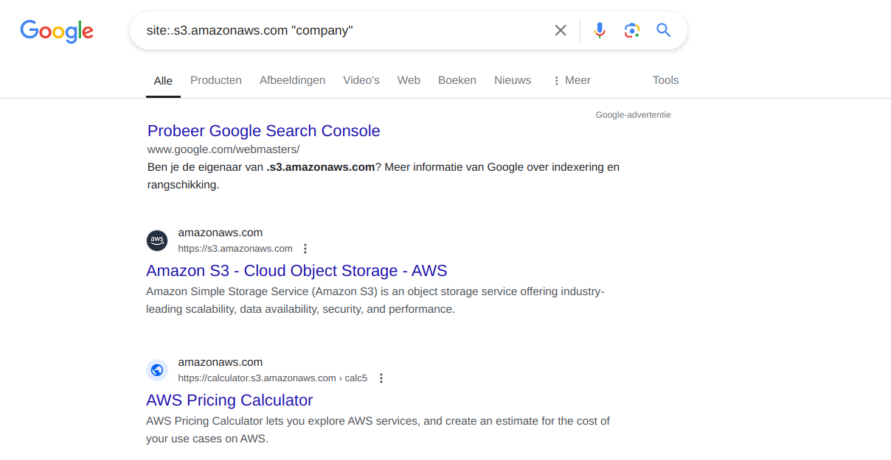
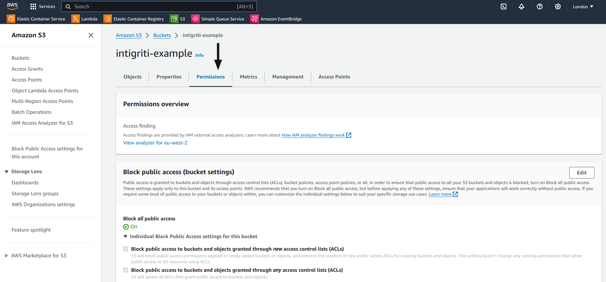
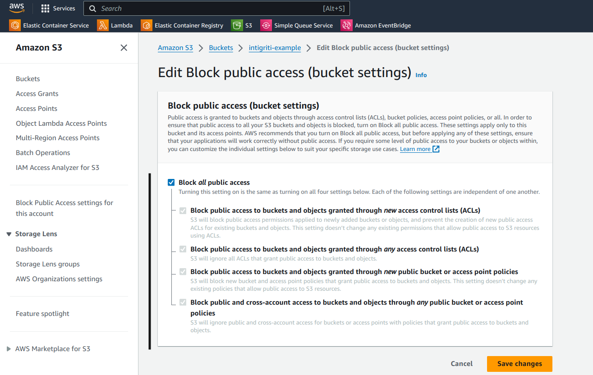
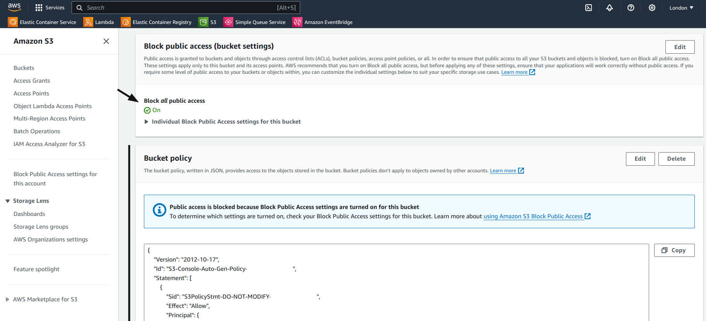

# Misconfigured Bucket List Permissions

#### Description:

AWS S3 (Simple Storage Service) buckets are a popular storage service used by software companies and organizations to store public as well as sensitive data.

Because AWS S3 can be used to store sensitive data, AWS allows developers to set up permissions for individual buckets and objects.

These permissions (or Access Control Lists) are sometimes overly permissive and allow unauthorized users to view more data than allowed.

#### Testing:

You can make use of search syntaxis supported by major search engines like Google to find AWS S3 buckets belonging to your target company or organization:

```md
site:.s3.amazonaws.com "company"
```

<figure><figcaption></figcaption></figure>


You can use the official AWS CLI to test for misconfigured list permissions using the `s3` subcommand:

```sh
$ aws s3 ls s3://{BUCKET_NAME} --no-sign-request
```

The output of an AWS S3 bucket with misconfigured list permissions:
```
2024-08-31    09:00:00         1337 index.html
                                PRE downloads/
2024-08-31    09:00:00         1337 archive.zip
```

The output of a secured AWS S3 bucket:
```

An error occurred (AccessDenied) when calling the ListObjectsV2 operation: Access Denied

```


Before reporting a potential security misconfiguration, always verify the owner of the bucket and the impact of the vulnerability! Some AWS S3 buckets are meant to be public, some may not even belong to your target!



#### Remediation:

To secure your AWS S3 buckets, login to your AWS console and follow the steps below:

1. Once signed in, navigate to your S3 dashboard
2. Open your bucket that you'd like to secure or verify access controls for
3. Open the **Permissions** tab, and click on **Edit** under the **Block public access (bucket settings)** section
<figure><figcaption></figcaption></figure>

4. Next, verify that all public access is blocked (or ensure only the desired settings are enabled)
5. Save your changes
<figure><figcaption></figcaption></figure>

6. Go back to the **Permissions** tab and scroll down to the **Bucket policy** section
7. Ensure that you do not have any unwanted policies listed
8. Additionally, verify that **Block all public access** is enabled (a green checkmark must appear next to it)
<figure><figcaption></figcaption></figure>


If your Access Control Lists take precedence over your Bucket Policies, make sure to verify your Access Control Lists as well!


#### Potential Impact:

A misconfigured AWS S3 bucket can often introduce security risks, data leaks, or other unintended consequences. Especially if the storage bucket is used for storing sensitive data (such as backups, receipts, invoices, etc.).

#### References:

* [https://blog.intigriti.com/hacking-tools/hacking-misconfigured-aws-s3-buckets-a-complete-guide](https://blog.intigriti.com/hacking-tools/hacking-misconfigured-aws-s3-buckets-a-complete-guide)
