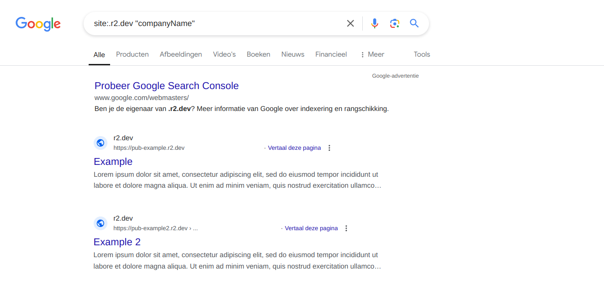
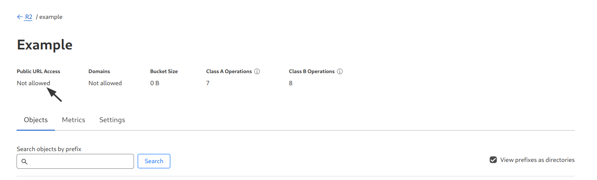
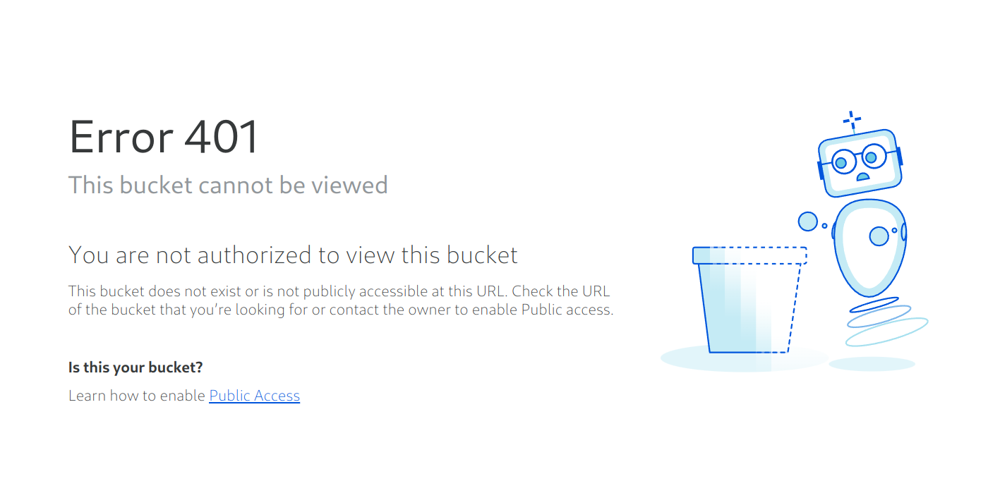

# R2.DEV Enabled

#### Description:

Cloudflare R2 storage is a high-performance, zero-egress fee storage service that allows developers to store (private) unstructured data objects (such as invoices or backups) and also use it as a CDN to store publicly accessible files (such as images, videos and even static HTML and JavaScript files).

R2.DEV is a simple feature within Cloudflare R2 that provides developers the ability to make their buckets publicly accessible for testing purposes. If this feature is left enabled (by accident), it can open up a new attack surface and allow bad actors to view sensitive data on the bucket. This often leads to PII or other excessive data leaks.

#### Testing:

You can make use of search syntaxis supported by several popular search engines like Google to enumerate R2 buckets belonging to your target company or organization:

```md
site:.r2.dev "company"
```

<figure><figcaption></figcaption></figure>


Before reporting a potential security misconfiguration, always verify the owner of the bucket and the impact of the vulnerability! Some Cloudflare R2 buckets are meant to be public, some may not even belong to your target!


#### Remediation:

To verify that public access is disabled on your Cloudflare R2 bucket, you must ensure that:
- you have no domain assigned to your R2 storage bucket
- R2.DEV is disabled

<figure><figcaption></figcaption></figure>

Visiting the index page of your R2 storage bucket endpoint should return the following response:

<figure><figcaption></figcaption></figure>

#### Potential Impact:

A Cloudflare R2 storage bucket with R2.DEV enabled (unintended) can often introduce security risks, data leaks, or other unintended consequences. Especially if the storage bucket is used for storing sensitive data (such as backups, receipts, invoices, etc.).


#### References:

* [https://blog.intigriti.com/hacking-tools/hacking-misconfigured-cloudflare-r2-buckets-a-complete-guide](https://blog.intigriti.com/hacking-tools/hacking-misconfigured-cloudflare-r2-buckets-a-complete-guide)
* [https://developers.cloudflare.com/r2/](https://developers.cloudflare.com/r2/)
* [https://developers.cloudflare.com/r2/buckets/public-buckets/](https://developers.cloudflare.com/r2/buckets/public-buckets/)