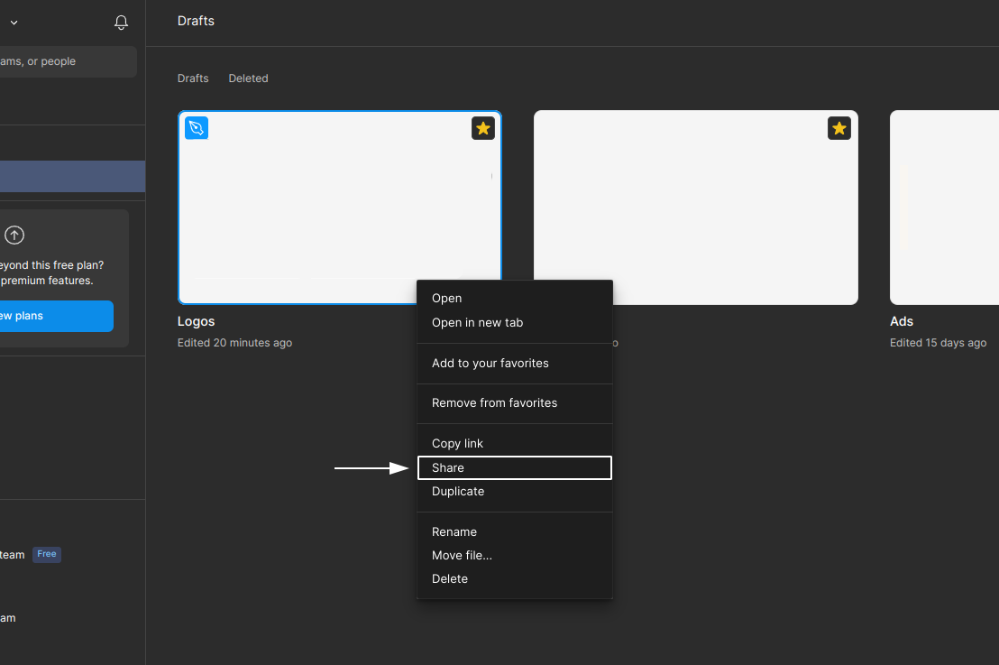
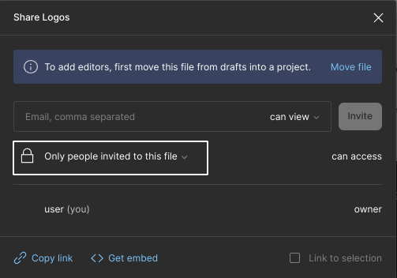

# View access misconfiguration

#### Description:

Figma is a collaborative platform for interface designs. Figma Drafts get assigned public view access by default for anyone who has access to the link.\
\
This can be seen as a potential issue on the financial side of your business. As perhaps early-stage promotional content is not meant to be public yet. Moreover, it is also best-practice to only allow view access to authorized team members.

#### Testing:

Simply visit the Figma Design file link and observe the response, an example of a link looks like the following:

```
https://www.figma.com/file/{DesignID}/{DesignFileName}
```

#### Remediation:

You can easily disable view access for every unauthorized user, to do so:

1. Sign in to your Figma account
2. Right-click the design file
3. Click on **Share** in the select menu
4. Select **Only people invited to this file** instead of **Anyone with the link**
5. Each user that attempts to view your design will now be required to sign in first instead

<figure><figcaption></figcaption></figure>

<figure><figcaption></figcaption></figure>

#### Potential Impact:

Unauthorized users are able to view the contents of early-stage design files in case your company makes use of Figma.

#### References:

* [https://help.figma.com/hc/en-us/articles/1500007609322-Guide-to-sharing-and-permissions](https://help.figma.com/hc/en-us/articles/1500007609322-Guide-to-sharing-and-permissions)
