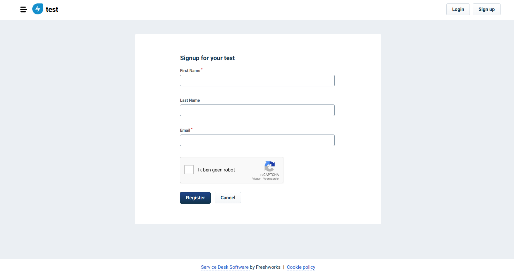
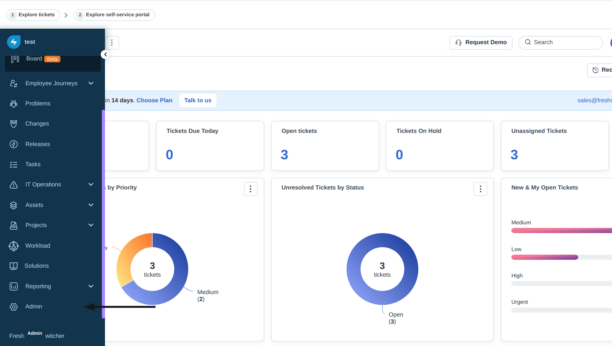
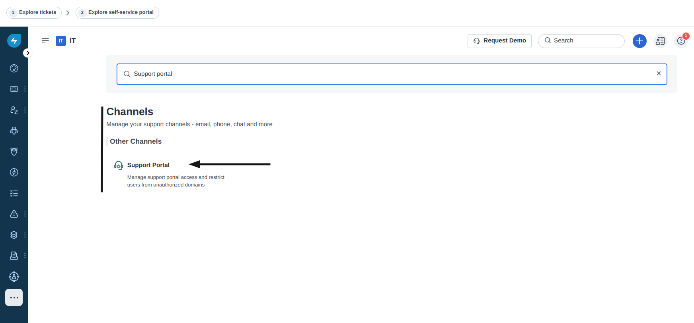
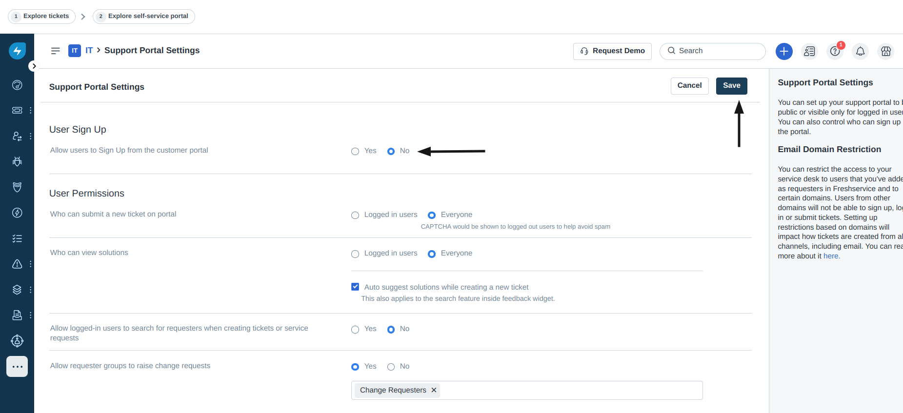

# Open User Registration

#### Description:

It is possible that anyone can signup in your Freshworks Freshservice instance due to a misconfiguration in the domain allow list. **Freshservice allows by default anyone to create an account on your instance.**

#### Testing:

You can cross-check if user registration is open for anyone by navigating to the following app route:

```
https://<companyName>.freshservice.com/support/signup
```

<figure><figcaption></figcaption></figure>

#### Remediation:

Make sure to set the proper setting for new signups. One way to do so is:

1. Visit your **Freshworks Freshservice Instance**
2. Next, click on **Admin** in your side-navigation menubar
<figure><figcaption></figcaption></figure>

3. And search for **"Support portal"** and click on it
<figure><figcaption></figcaption></figure>

4. And finally, select the option **No** under **"Allow users to Sign Up from the customer portal"**
5. Make sure to click **"Save"** to save your changes.

<figure><figcaption></figcaption></figure>


#### Potential Impact:

In case registrations are left open for anyone to signup to your Freshworks Freshservice instance, depending on the in-app permissions set, it could mean that new users get access to internal-only resources, such as support tickets, company metrics or even personal identifiable information (PII) of customers or clients.


#### References:

* [https://infosecwriteups.com/hundreds-of-companies-internal-data-exposed-part-2-the-freshservice-misconfiguration-a9432c0b5dc8](https://infosecwriteups.com/hundreds-of-companies-internal-data-exposed-part-2-the-freshservice-misconfiguration-a9432c0b5dc8)
* [https://partnersupport.freshworks.com/en/support/solutions/articles/225287-how-can-i-disable-the-option-for-requesters-to-sign-up-to-our-helpdesk-](https://partnersupport.freshworks.com/en/support/solutions/articles/225287-how-can-i-disable-the-option-for-requesters-to-sign-up-to-our-helpdesk-)
