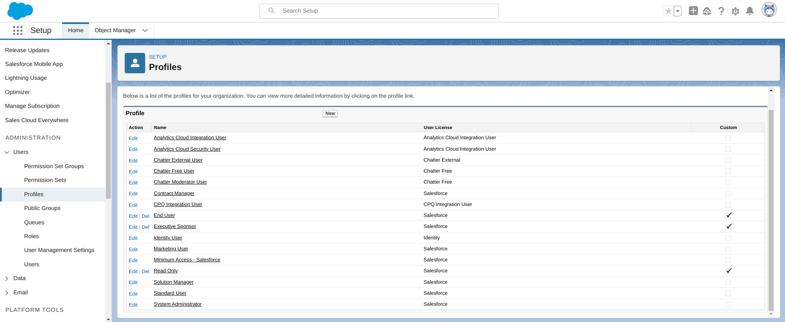
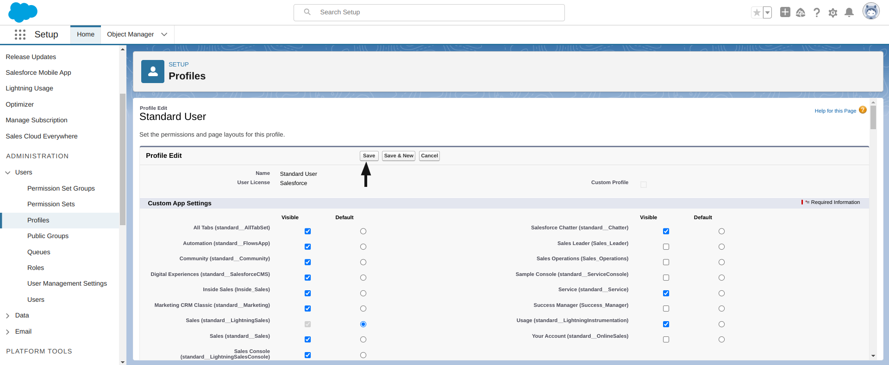

# Salesforce Lightning Aura Component Enabled

#### Description:

Salesforce Experience (or Community) Cloud is a Customer Relationship Management (CRM) platform often used by software companies and organizations to manage their customer relationships, share information & collaborate with their employees and customers (documentation, knowledge bases, help articles, etc.), to provide support using support ticketing and much more.

It's a public-facing platform and thereby also indexed by popular search engines like Google and Bing.

Salesforce Communities (Experience Cloud) is built upon the Salesforce Lightning Framework. This framework has a set of reusable components to help developers, admins, and IT teams easily create web and mobile applications.

Salesforce Lightning consists of Aura components, these components are self-contained and reusable allowing developers to speed up the development of their projects.

The framework already comes with pre-built base components that developers and admins can use but Salesforce Lightning also provides the option to create your custom components using Salesforce's strongly typed programming language, Apex.

A custom component can be defined to view or modify data in Salesforce. However, properly enforcing role-based permissions, and adhering to the "Least-privilege" principle often proves to be difficult for inexperienced users as it can get complex rapidly.

A misconfigured custom component can lead to a wide variety of security vulnerabilities, from excessive data leaks (often including personally identifiable information, or PII) to horizontal/vertical privilege escalation.

 As outlined in the official documentation, custom Aura components should only be used when Salesforce Lightning does not provide built-in support for the required feature or functionality. 

#### Testing:

Replicate the following POST HTTP request to verify that the Aura API endpoint is enabled for Guest profile (unauthenticated visitors):

```http
POST /aura HTTP/2
Host: {TARGET}.lightning.force.com
Content-Type: application/json

{}
```

The endpoint should respond with a 401 Unauthorized status code indicating an invalid session error (`aura:invalidSession`):

```http
HTTP/2 401 Unauthorized
Strict-Transport-Security: max-age=63072000; includeSubDomains
X-Content-Type-Options: nosniff
X-Robots-Tag: none
Referrer-Policy: origin-when-cross-origin
Cache-Control: no-cache,must-revalidate,max-age=0,no-store,private
Content-Type: application/json

{"event":{"descriptor":"markup://aura:invalidSession","attributes":{"values":{}},"eventDef":{"descriptor":"markup://aura:invalidSession","t":"APPLICATION","xs":"I","a":{"newToken":["newToken","aura://String","I",false]}}},"exceptionEvent":true}
```

If the HTTP request above returned a 404 status code, try requesting one of the following API endpoints:

```
/sfsites/aura
/s/sfsites/aura
```

The target instance can also be pointed to one of the following FQDNs:
```
*.force.com
*.secure.force.com
*.live.siteforce.com
```

#### Remediation:

Salesforce Lightning employs a role-based security model and essentially allows admins to configure security access controls on CRUD operations at three separate levels: the Object (database), Field (column), and Record (data entry) levels.

Revising the current options for each (custom) profile and adhering to the principle of least privilege is essential.

On your Salesforce Lightning instance, you can navigate to `/lightning/setup/Profiles/home` to view all the profiles.

<figure><figcaption></figcaption></figure>

Select a profile and revise each enabled permission individually. Make changes to the profiles accordingly.

<figure><figcaption></figcaption></figure>

**Make sure to save your changes at the end.**


**Do not only set permissions for Guest (unauthenticated) visitors.** A common mistake admins make is only enforcing access controls for non-authenticated users when it is possible for any visitor to sign up for an account.


**It is also strongly recommended to turn off API access to Guest (unauthenticated) visitors.**

#### Potential Impact:

When insufficient access controls are enforced on Salesforce Lightning, unauthorized users may retrieve sensitive data, perform unwanted actions, and/or even escalate their current privileges.

Revising all access controls and preventing unauthorized users from viewing or performing actions beyond what is required in their scope or role is necessary.

#### References:

* [https://www.enumerated.ie/index/salesforce](https://www.enumerated.ie/index/salesforce)
* [https://www.enumerated.ie/index/salesforce-lightning-tinting-the-windows](https://www.enumerated.ie/index/salesforce-lightning-tinting-the-windows)
* [https://infosecwriteups.com/in-simple-words-pen-testing-salesforce-saas-application-part-1-the-essentials-ffae632a00e5](https://infosecwriteups.com/in-simple-words-pen-testing-salesforce-saas-application-part-1-the-essentials-ffae632a00e5)
* [https://infosecwriteups.com/in-simple-words-pen-testing-salesforce-saas-application-part-2-fuzz-exploit-eefae11ba5ae](https://infosecwriteups.com/in-simple-words-pen-testing-salesforce-saas-application-part-2-fuzz-exploit-eefae11ba5ae)
* [https://infosecwriteups.com/salesforce-bug-hunting-to-critical-bug-b5da44789d3](https://infosecwriteups.com/salesforce-bug-hunting-to-critical-bug-b5da44789d3)
* [https://www.biswajeetsamal.com/blog/salesforce-object-key-prefix-list/](https://www.biswajeetsamal.com/blog/salesforce-object-key-prefix-list/)
* [https://www.varonis.com/blog/abusing-salesforce-communities](https://www.varonis.com/blog/abusing-salesforce-communities)
* [https://web.archive.org/web/20210116171949/https://mcafee.com/blogs/enterprise/cloud-security/17-must-enable-salesforce-security-capabilities-and-other-best-practices/](https://web.archive.org/web/20210116171949/https://mcafee.com/blogs/enterprise/cloud-security/17-must-enable-salesforce-security-capabilities-and-other-best-practices/)
* [https://developer.salesforce.com/docs/atlas.en-us.lightning.meta/lightning/intro_lightning.htm](https://developer.salesforce.com/docs/atlas.en-us.lightning.meta/lightning/intro_lightning.htm)
* [https://help.salesforce.com/s/articleView?id=ind.media_asm_Disable_Lightning_Web_Security.htm&type=5](https://help.salesforce.com/s/articleView?id=ind.media_asm_Disable_Lightning_Web_Security.htm&type=5)
* [https://trailhead.salesforce.com/content/learn/modules/data_security/data_security_records](https://trailhead.salesforce.com/content/learn/modules/data_security/data_security_records)
